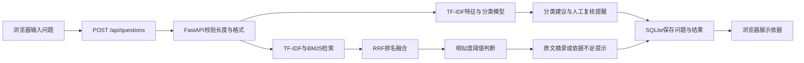

# 架构与代码导读

## 一次提问经过哪里

界面不直接读数据库。它调用接口，接口负责验证输入、调用算法和保存结果。这样以后更换界面或模型时，不必重写全部代码。

## 从最少的文件开始读

1. `static/app.js`：找到 `question-form` 的提交事件，看到 `api('/questions', 'POST', ...)`。
2. `app/main.py`：找到 `question` 函数，看到 `analyze(...)` 和数据库插入。
3. `app/engine.py`：找到 `analyze`，顺着 `triage.predict` 和 `retriever.search` 往下读。
4. `app/storage.py`：看三行关键数据库行为：打开连接、提交成功修改、出错回滚。
5. `tests/test_workflow.py`：看测试怎样创建隔离数据库并验证结果。

## 算法一：分类

`Triage` 用96条训练句子构建字符1至3元片段特征，然后训练逻辑回归。比如“退款到账”可以拆出“退”“退款”“退款到”等片段。TF-IDF帮助模型区分常见片段和更有辨识度的片段。测试句子只进行 `transform`，不参与训练词表的 `fit`。

逻辑回归学到每类与这些片段之间的关系。`predict_proba` 返回各类别的模型分数，最高者作为推荐类别。0.45以下提醒复核。它没有校准，不能宣称“模型分数71%就有71%概率正确”。小样本模型可能过度自信，也可能把陌生问题硬分到现有类别。

## 算法二：检索

- TF-IDF：把问题和每篇规范变成稀疏向量，计算余弦相似度。
- BM25：对中文双字片段和英文词项计分，考虑命中次数、稀有程度和文档长度。
- RRF：将两种排名按 `1/(60 + 排名)` 相加，只计入实际命中的文档。

这两路都属于词项/字符匹配。这里没有语义嵌入模型，不应在简历上写“BERT语义检索”或“稠密向量检索”。

文档级检索在12篇短规范上容易讲清，也便于检查。数据变大后，现有实现要重新评估：导入会重建全量索引；BM25每个问题会扫描全部文档。不是万级文档的生产方案。

## 为什么不总回答

当前第一名文档的字符相似度至少0.18，才显示其原文摘录。这个阈值是经验参数，不是安全保证。当前评测中有5个已知问题被保守处理，说明“尽量少答错”和“尽量多回答”之间存在取舍。

改进时，应先额外收集验证集，包含同义表达、否定、多意图、词汇接近的无关问题，再画阈值对覆盖率和误答率的影响。不能为了现有24题全对而不断调参后再宣称测试集成绩。

## 数据库

| 表 | 保存什么 | 用途 |
|---|---|---|
| documents | 规范标题、类别、内容、内容摘要 | 去重、重建索引 |
| questions | 原问题、当时完整结果、反馈 | 复盘错误和用户体验 |
| tickets | 标题、内容、类别、优先级、状态 | 人工处理主记录 |
| ticket_events | 工单编号、动作、备注、时间 | 审计与追踪 |

工单状态更新与事件写入在同一个事务中。`BEGIN IMMEDIATE`让并发更新串行检查，避免两个请求同时通过过期状态判断。SQL参数使用占位符，用户文字不会变成SQL命令。界面使用HTML转义展示资料。

导入文档时先尝试建好新索引，成功后提交数据库并替换内存索引。问题查询可以继续使用旧的完整索引，不会拿到构建了一半的数据。这是单进程内的设计；多工作进程需要索引同步机制。

## 主要接口

| 请求 | 作用 |
|---|---|
| GET /api/health | 检查服务与启动入口是否匹配 |
| GET /api/overview | 真实数据库统计 |
| POST /api/questions | 分析问题并保存快照 |
| POST /api/questions/{id}/feedback | 保存或覆盖反馈 |
| GET /api/documents | 获取规范 |
| POST /api/documents | 添加规范并更新索引 |
| GET /api/tickets | 工单与事件列表 |
| POST /api/tickets | 用户确认后创建工单 |
| PATCH /api/tickets/{id} | 合法状态流转并保存备注 |
| POST /api/evaluation | 固定语料独立评测 |
| GET /openapi.json | 机器可读接口定义 |

## 真正适合后续动手的升级

优先做：更独立的评测语料、错误分类纠正的标注表、文档版本与撤回、阈值对比实验。之后再考虑基于BERT的语义向量和CrossEncoder重排，须与现有BM25基线对照验证。若最终接大模型，需要把检索资料作为不可信上下文，并单独检查引用是否支持生成答案。

官方参考：[TF-IDF](https://scikit-learn.org/stable/modules/generated/sklearn.feature_extraction.text.TfidfVectorizer.html)、[交叉验证与测试划分](https://scikit-learn.org/stable/modules/cross_validation.html)、[语义检索](https://www.sbert.net/examples/sentence_transformer/applications/semantic-search/README.html)。
