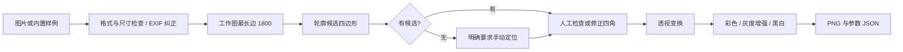

# 技术说明

## 数据流

前端为本地静态页面和 Canvas，后端为 FastAPI。上传请求进入线程池执行图像计算，避免直接阻塞异步请求循环；没有建立跨请求状态或数据库。处理结果用 PNG data URL 返回，较直接二进制传输有额外体积开销，适合受限尺寸的本机演示。

## 关键文件

| 文件 | 责任 |
| --- | --- |
| `app/vision.py` | 解码、候选检测、角点校验、透视校正、增强 |
| `app/main.py` | API、本机访问限制、静态文件、上传生命周期 |
| `app/synthetic.py` | 原创版式、可控透视和干扰、真实角点 |
| `app/evaluate.py` | 逐条误差、IoU、负例、检测时延 |
| `static/app.js` | Canvas 四角交互、请求状态、效果切换和下载 |
| `tests/test_scan.py` | 几何契约、输入处理、API 行为 |

## 坐标和参数

浏览器坐标为归一化 `[0,1]`，相对于 EXIF 纠正并缩小后的工作图。后端转换为 `x*(w-1), y*(h-1)`；导出矩阵也是工作图到输出图的映射，并非原始相机图到输出的完整变换。

`POST /api/process` 使用 multipart：`file`，可选 `corners`（JSON 字符串），`aspect`，奇数 `block_size` 和 `c`。`corners` 留空触发自动检测；传入四点表示用户明确确认的手动区域。交叉、重合、越界、非有限数值或过小区域被拒绝。

成功返回 `ready`、三种输出、矩阵与诊断字段。没有候选返回 `needs_manual` 和调整起点，不生成输出；前端禁用下载。检测到了错误候选时仍可能返回 `ready`，这个状态表示处理完成，不表示定位正确。

修改参数会让旧结果失效，必须重新应用才能下载。请求期间禁用角点与参数编辑，避免请求使用的参数和显示参数错位。处理错误会保留可见的上次预览并明确标记失效，下载继续禁用。

## 评测含义

角点误差用循环/反向对齐消除等价顶点起点差异，再除以图像对角线。IoU 为预测区域与真值区域交集面积除以并集面积。通过条件同时约束两者，避免把“检测到四边形”当成正确率。

低对比、模糊等合成条件都是生成器设定的有限范围，不代表任意严重程度。纯色负例太简单，后续应增加屏幕、桌面纹理、书本封面等困难负例。时延不含图像加载、增强、编码；界面处理用时包含检测、变换、增强与编码，但不含上传和最初解码。

候选分数、Laplacian 方差与区域面积都是启发式量，没有概率校准。手动操作只改变区域，不会使缺失的内容恢复。
