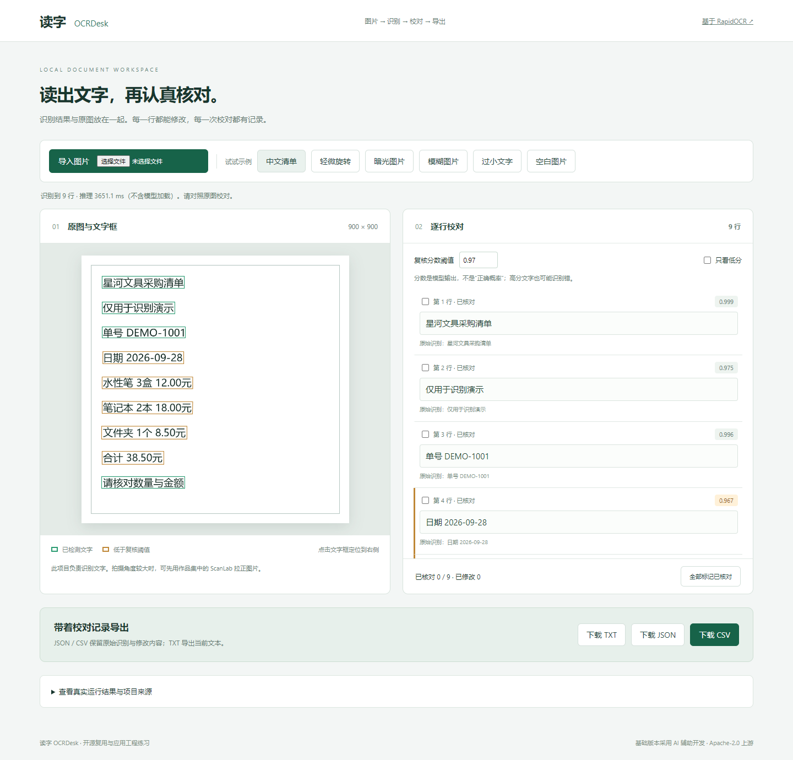

# 读字 OCRDesk · 本机文字校对工作台

**基于 [RapidAI/RapidOCR](https://github.com/RapidAI/RapidOCR) 的开源复现与应用改造。** 上传中文/英文图片，查看识别框和文字，人工核对，再导出结果。模型来自上游；新增工作台、校对流程、导出和评测，不把模型包装成自研。



## 为什么适合放进实习作品集

展示“把开源模型接成可用功能”的过程：本地推理、API、图片处理、人工复核、数据导出、输入边界和可复现测试。可与作品集的 ScanLab 配合：先拉正图片，再识别文字。适合作为 AI 应用开发或视觉应用工程的学习材料，岗位价值取决于你能否解释和改进代码。

## 快速体验

本机验证：Windows、Python **3.13.14**、RapidOCR **3.9.2**、ONNX Runtime **1.30.0**（CPU）。完整依赖见 `requirements-lock.txt`。

1. 安装 Python 3.13，勾选 Add Python to PATH。
2. 进入 `11-OCRDesk` 文件夹，双击 `setup.cmd` 安装依赖；第一次需要联网，模型随 RapidOCR 安装包提供。
3. 双击 `启动项目.cmd`，优先在 Edge 打开 **http://127.0.0.1:8771**。
4. 选择“中文清单”，点击左侧文字框，修改右侧一行文字并勾选“已核对”。
5. 下载 CSV 或 JSON，比较原始识别和修改内容。停止时按服务窗口的 Ctrl+C 或运行 `停止项目.cmd`。

如果 Python 不在 PATH，可在 PowerShell 中指定解释器运行安装脚本：`./setup.cmd "你的Python3.13完整路径\python.exe"`。

## 功能与边界

- 支持 JPG / PNG / WebP，文件 ≤ 8 MiB、像素 ≤ 2000 万、宽高至少32，工作图最长边1800；处理EXIF旋转和透明底色。
- 原图文字框与右侧行联动；低于自定义阈值的行突出显示，但**模型分数不是正确概率**。
- 修改文字会取消该行“已核对”，避免旧核对状态被误用。
- TXT仅保存当前文字；JSON保存文字框、原文、修改和核对状态；CSV保存原文与校对结果，带UTF-8 BOM和公式保护。
- 本机单进程串行推理，不保存历史；框架接收较大上传时可能创建系统临时文件。无第三方图片上传、无外部字体和统计脚本。
- 不包含PDF、表格结构识别、票据字段抽取、手写识别专门优化或大规模并发服务。阅读顺序沿用上游，对复杂多栏版式仍需人工复核。

## 真实运行与复现

```powershell
.\.venv\Scripts\python.exe upstream\quickstart.py
.\.venv\Scripts\python.exe -m pytest -q
.\.venv\Scripts\python.exe -m app.evaluate
```

也可双击 `check.cmd`。当前 **13 项自动测试通过**，覆盖真实模型推理、空白图、图片限制、EXIF、透明底色、CSV公式保护、字符误差和API。

固定合成开发集：同一版式的5张有字图（清晰、暗光、轻旋转、模糊、缩小）与1张空白图。5张图每张86个归一化字符，当前总字符错误率 **CER = 0 / 430 = 0%**；空白图没有输出文字。

这个结果只说明极小、同字体、同内容的合成集通过，**不能写成实拍准确率100%**。评测将字符做NFKC规范化并去掉空白，保留标点，按上游阅读顺序拼接；不衡量文字框定位质量。逐图输出与时延见 [benchmark.json](docs/benchmark.json)。下一步应采集独立真实照片并人工标注。

## 上游、改造与学习

- [来源、固定提交、许可与复现差异](upstream/README.md)
- [第一课与代码阅读顺序](docs/01-学习与面试.md)
- [验证记录](docs/02-验证记录.md)
- [模型名称和SHA-256](docs/model-manifest.json)

本项目是AI辅助开发的开源应用工程练习。复用了RapidOCR/PaddleOCR模型能力，保留上游许可证与版权；新增部分采用Apache-2.0，见 `LICENSE` 和 `NOTICE`。GitHub仅展示源码、文档和截图，交互页面需要在本机启动Python服务。
