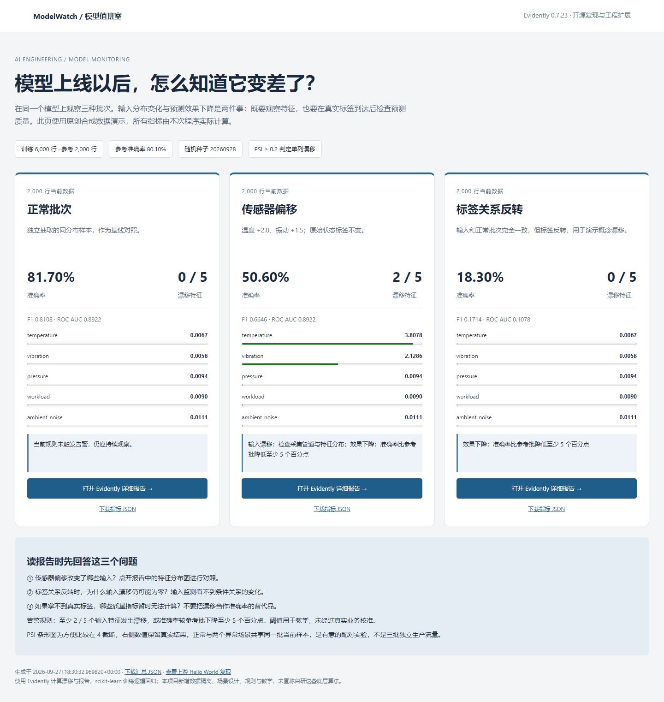

# ModelWatch · 模型值班室

**基于 Evidently 官方示例的模型监测复现与工程扩展。** 用三个可复现的场景回答：模型上线后，输入变了没有？预测效果变差没有？

适合人工智能技术应用专业的机器学习工程、算法应用、AI 测试与数据质量实习作品展示。项目重在数据隔离、模型评价、故障实验、监测报告与结果解释，不把底层开源算法包装成自研。



## 先看结果，再跑一遍

仓库带有实际生成的 HTML 报告。下载本目录后，双击 `reports/index.html` 即可查看；GitHub 文件页通常只显示 HTML 源码，不等于线上演示网站。

重新计算需要 Python 3.13，首次安装需要联网；之后运行无需 API Key，也不连接 Evidently Cloud。

1. 双击 `setup.cmd`，创建独立 `.venv` 并安装锁定依赖。
2. 双击 `start.cmd`，重新训练、评价、生成报告，并用 Edge 打开结果。
3. 双击 `check.cmd`，检查依赖和关键测试。
4. 双击 `reproduce-upstream.cmd`，单独复现官方 Iris Hello World。

也可以在项目目录打开 PowerShell：

```powershell
python --version
python -m venv .venv
.\.venv\Scripts\python.exe -m pip install -r requirements-lock.txt
.\.venv\Scripts\python.exe upstream/reproduce_hello_world.py
.\.venv\Scripts\python.exe -m modelwatch.pipeline
.\.venv\Scripts\python.exe -m pytest -q
```

先确认上面的 `python --version` 输出3.13，再创建环境。若系统有多个Python，可运行 `./setup.cmd -PythonPath "C:\你的Python3.13路径\python.exe"` 指定解释器。

实测环境：Windows、Python **3.13.14**、Evidently **0.7.23**、scikit-learn **1.9.1**。运行脚本不启动常驻服务，关闭报告标签页即可结束查看。程序在导入 Evidently 前关闭其遥测开关。

## 实际运行结果

固定随机种子 `20260928`。训练 6,000 行、独立参考 2,000 行、独立当前 2,000 行。标准化器与逻辑回归只在训练批拟合；参考批准确率为 **80.10%**。

| 当前场景 | 准确率 | F1 | ROC AUC | 漂移输入列 | 触发规则 |
| --- | ---: | ---: | ---: | ---: | --- |
| 正常批次 | 81.70% | 0.8108 | 0.8922 | 0 / 5 | 无 |
| 传感器偏移 | 50.60% | 0.6646 | 0.8922 | 2 / 5 | 输入漂移、效果下降 |
| 标签关系反转 | 18.30% | 0.1714 | 0.1078 | 0 / 5 | 效果下降 |

数字来自 [summary.json](reports/summary.json)，不是预填的演示值。Evidently 和 scikit-learn 的准确率逐项核对一致。9 项关键测试通过，依赖完整性检查通过；测试中有第三方依赖弃用警告，详见[验收记录](docs/03-验证与局限.md)。

传感器偏移让线性模型的分数整体平移，因此排序和 AUC 不变，但默认 0.5 阈值下的分类与概率校准变差。这个例子说明只看 AUC 也可能漏掉问题。

## 上游是什么，增加了什么

- 上游仓库：[evidentlyai/evidently](https://github.com/evidentlyai/evidently)，Apache-2.0。
- 固定源码：[README 的 Data and ML evals 示例](https://github.com/evidentlyai/evidently/blob/34771fe41c08ca074d96a52aaf4a45cd640cbaf5/README.md#data-and-ml-evals)。commit：`34771fe41c08ca074d96a52aaf4a45cd640cbaf5`。
- 实际调用的 Python 包：[Evidently v0.7.23](https://github.com/evidentlyai/evidently/releases/tag/v0.7.23)。上面的 commit 固定示例文本；锁文件固定运行依赖。
- [复现脚本](upstream/reproduce_hello_world.py) 保留官方 Iris 数据切片与报告调用，新增命令行入口、遥测关闭、输出保存。它已实际运行，输出 6 项指标，[摘要证据](reports/upstream/run-summary.json) 与 HTML/JSON 都已保存。
- 官方示例按 Iris 原始行顺序切分，仅用于演示漂移 API；**本项目没有把它当作模型测试集划分范本**。

本项目新增的是原创合成数据、训练/参考/当前三批隔离、三个配对故障场景、预测质量检查、两类告警规则、中文总览、锁定安装与回归测试。漂移统计与详细报告由 Evidently 实现，标准化和逻辑回归由 scikit-learn 实现。

## 数据与监测规则

五个输入列为 `temperature`、`vibration`、`pressure`、`workload`、`ambient_noise`，都是无量纲标准化数值。名称模拟设备数据，**并非真实传感器测量**。标签由公开在源码中的逻辑函数与固定随机过程生成，不存在外部数据授权问题。

- 正常：和参考批来自同一生成分布。
- 传感器偏移：当前批的温度加 2.0、振动加 1.5，标签保持原始值，模拟采集值偏移。
- 标签关系反转：当前批输入不变，标签 `0 ↔ 1`，是讲解概念漂移的极端设定。

后两种场景从同一正常当前批复制，构成配对控制实验，不是三批独立生产流量。训练、参考、当前基础批的样本 ID 互斥；各批哈希保存在汇总 JSON。

输入监测仅包含五个特征，明确排除标签、预测、概率和样本 ID。Evidently 使用 PSI，单列阈值 `≥ 0.2`；至少 2 / 5 列漂移触发输入规则。准确率相对参考批下降至少 5 个百分点触发质量规则。这些阈值为教学设置，尚未进行业务校准。

## 文件怎么读

| 文件 | 学习重点 |
| --- | --- |
| `modelwatch/data.py` | 固定种子、数据隔离、两类异常如何构造 |
| `modelwatch/pipeline.py` | 训练、预测、Evidently schema、漂移与效果指标 |
| `modelwatch/presentation.py` | 根据真实汇总生成中文静态页面 |
| `reports/*.html` | Evidently 交互式分布、混淆矩阵与 ROC 图 |
| `reports/summary.json` | 机器可读指标、依赖版本、数据哈希 |
| `tests/test_monitoring.py` | 数据泄漏防线、真实漂移行为、指标一致性 |
| `upstream/` | 原始 README、固定 commit、复现脚本与许可证 |

[7 分钟入门](docs/01-七分钟上手.md) · [面试讲解与下一步](docs/02-面试与改进.md) · [验证与局限](docs/03-验证与局限.md) · [来源与许可](THIRD_PARTY_NOTICES.md)

## 当前边界

这是离线批次监测教学项目，没有接真实生产流量、标签回流、用户权限、邮件告警、数据库或自动重训练。输入漂移不能替代预测质量；准确率等指标需要真实标签。它展示工程方法，不提供真实工业故障识别性能结论。

自有代码采用 [Apache-2.0](LICENSE)，上游代码和 Iris 数据归属保留在 [THIRD_PARTY_NOTICES.md](THIRD_PARTY_NOTICES.md)。
