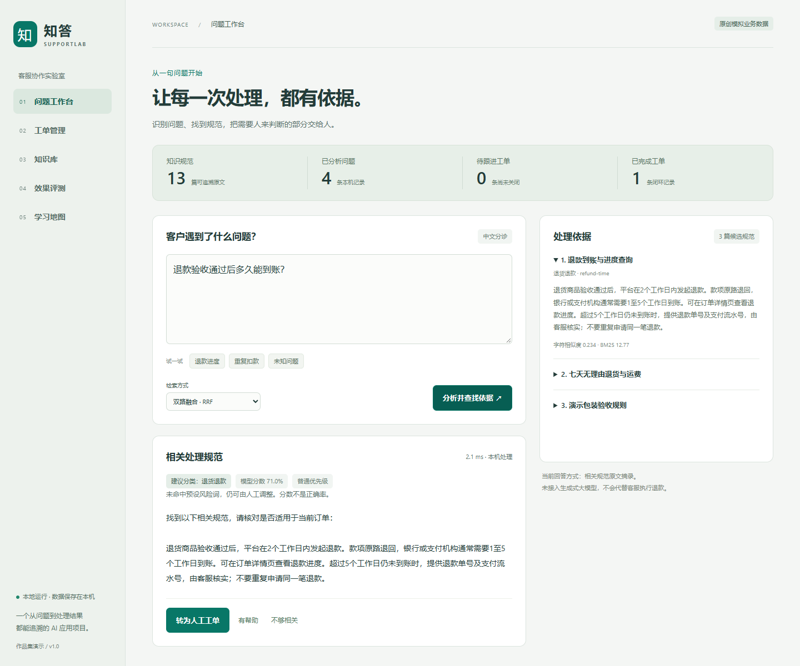
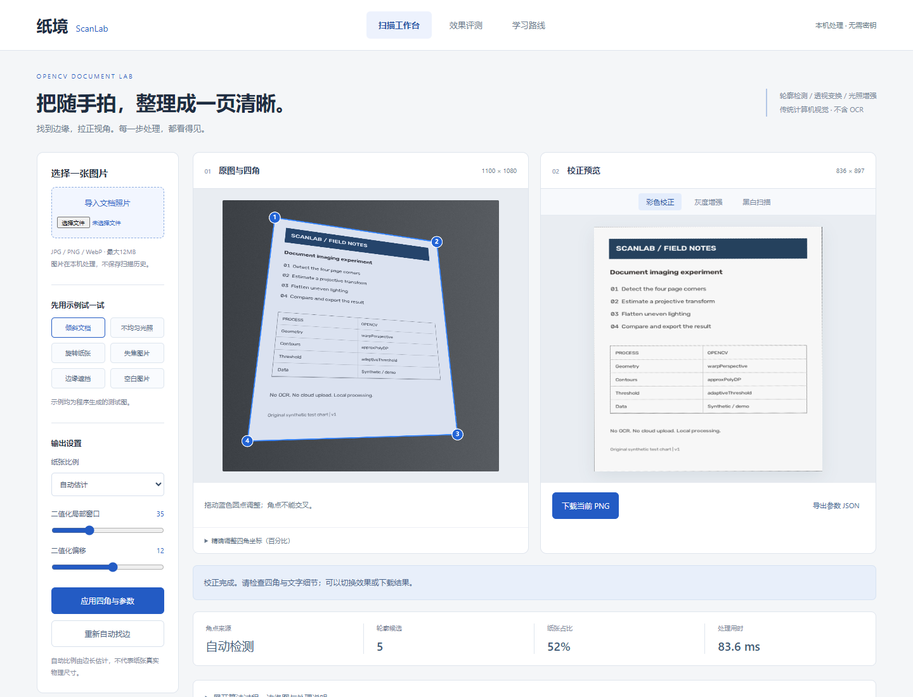

# 饶彦军 · 项目作品集

> 广东岭南职业技术学院 · 人工智能技术应用专业 · 2025级
> 求职方向：AI 应用开发 / 数据工程 / AI 产品测试（实习）
> 联系：电话 13631264097 ｜ 邮箱 3395488497@qq.com ｜ GitHub github.com/wrqwh5xwb2-commits

---

## 关于我

人工智能技术应用专业在读，习惯用工程化方式解决问题：从数据采集、清洗、建模到部署上线均有完整项目实践。重度 AI 编程工具使用者（WorkBuddy / Codex CLI / MCP 生态），能以"人 + AI 协作"模式在极短周期内交付完整项目（网站、小程序、爬虫系统、大数据环境）。

## 技术栈

| 领域 | 技术 |
|---|---|
| 语言 | Python（熟练）、JavaScript、SQL、Shell |
| AI/数据 | YOLOv8、BERT、OpenCV、Pandas、Matplotlib |
| Web/后端 | Flask、微信小程序原生开发、Nginx |
| 大数据 | Hadoop、HBase、Hive（伪分布式环境独立搭建） |
| 工具链 | Git、Linux、VMware、AI 编程工具（WorkBuddy/Codex/MCP） |

## 新增可运行项目：知答 SupportLab

[进入项目源码与运行说明](./09-SupportLab/) · [查看评测报告](./09-SupportLab/docs/benchmark-v1.json) · [学习路线](./09-SupportLab/docs/01-第一课与学习路线.md)

Python + FastAPI + scikit-learn + SQLite 实现客服问题分类、规范检索、原文引用和人工工单闭环。附16项自动测试、模拟数据评测与教学文档；采用AI辅助开发，尚未上线真实业务。

## 新增 OpenCV 项目：纸境 ScanLab

[进入源码与运行说明](./10-ScanLab/) · [从零上手](./10-ScanLab/docs/01-从零上手.md) · [逐条评测](./10-ScanLab/docs/benchmark.json)

OpenCV + Python + FastAPI 实现文档四角检测、透视校正、手动修边、光照增强与黑白扫描。附15项自动测试、真实界面截图和中文教程；固定合成开发集24张图中20张定位达标，尚未进行真实手机照片集验证。基础版本采用AI辅助开发，不含OCR。

## 项目索引

| # | 项目 | 类型 | 一句话 |
|---|---|---|---|
| 01 | [YOLOv8 目标检测](./01-YOLOv8目标检测/) | 计算机视觉 | 完整训练+推理 pipeline |
| 02 | [BERT 文本处理](./02-BERT文本处理/) | NLP | 预训练模型微调实践 |
| 03 | [豆瓣 Top250 爬虫](./03-豆瓣Top250爬虫/) | 数据采集 | 250部电影+海报，反爬对抗实战 |
| 04 | [当当网图书爬虫](./04-当当网图书爬虫/) | 数据采集 | 参数化多页采集+详情页二级爬取 |
| 05 | [清远特产导购系统](./05-清远特产导购系统/) | 全栈 | Flask+MySQL+Pandas 数据分析 |
| 06 | [晨达电脑维修官网](./06-晨达电脑维修官网/) | Web 上线 | 真实商业站点，含 SEO/备案/部署 |
| 07 | [晨达微信小程序](./07-晨达微信小程序/) | 小程序 | 8页面+云开发后端 |
| 08 | [Hadoop+HBase 环境搭建](./08-Hadoop-HBase环境搭建/) | 大数据运维 | 虚拟机伪分布式全链路排错 |
| 09 | [知答 SupportLab](./09-SupportLab/) | AI 应用 / NLP / 全栈 | 问题分类、规范检索、人工工单与可复现评测 |
| 10 | [纸境 ScanLab](./10-ScanLab/) | OpenCV / 计算机视觉 / 全栈 | 文档四角定位、透视校正、图像增强与可复现评测 |

---

*作品集持续更新，最后更新：2026-09*
